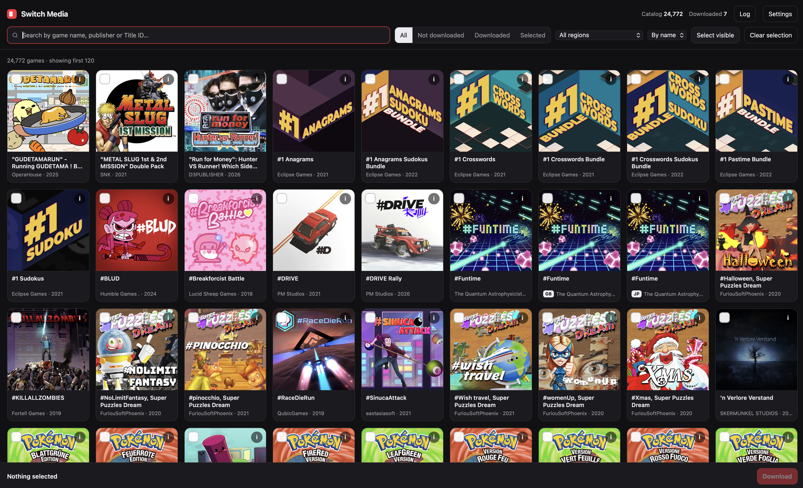

# Switch Media

**English** · [Türkçe](README.tr.md)

A small, self-hosted tool for bulk-downloading **Nintendo Switch game icons, banner / background images and theme music**. Search a catalog of ~25,000 games across several eShop regions in your browser, tick the ones you want, click *Download*, and every game gets its own neatly organised folder.



No database, no frameworks, no `pip install` — just Python's standard library, one HTML page and a JSON file that remembers what you've already downloaded.

---

## Features

- **Browse the whole Switch catalog** — ~25k games merged from the USA, Europe, Japan, Korea and Hong Kong eShops (Australia and Germany optional).
- **Fast search** by name, publisher or Title ID — including names in other regions (`ゼルダ` finds Zelda, `동물의 숲` finds Animal Crossing).
- **Filters**: all / not downloaded / downloaded / selected, by region, sort by name or release date.
- **Pick and download**: tick games one by one or "select visible", then download in parallel with a live progress bar and log.
- **Per-game assets**
  - `icon.jpg` — the square HOME-menu icon
  - `banner.jpg` — the wide eShop banner (works well as a background)
  - `screenshot_N.jpg` — optional, up to 6
  - `hero.png` / `logo.png` — optional, from SteamGridDB
  - `theme.mp3` — theme music from KHInsider, with optional YouTube fallback
  - `info.json` — name, publisher, release date, categories, description
- **Resumable** — files that already exist are skipped, so re-running only fills the gaps.
- **Download tracking without a database** — `downloaded.json` records what you have; the folder is rescanned on start-up, so deleting a game folder by hand is picked up automatically.
- **Detail view** with banner preview and an audio player for downloaded music.
- **Light / dark mode**, follows your system setting.
- **CLI mode** for scripting and batch jobs.

## Requirements

- **Python 3.9+** (the one that ships with macOS is fine). No third-party packages.
- *Optional, for YouTube music fallback:* [`yt-dlp`](https://github.com/yt-dlp/yt-dlp) and `ffmpeg`
  ```bash
  brew install yt-dlp ffmpeg
  ```
- *Optional:* a free SteamGridDB API key for hero and logo images. See [SteamGridDB API key](#steamgriddb-api-key-optional).

## Quick start

```bash
git clone https://github.com/cryptooth/switch-media.git
cd switch-media
python3 server.py
```

Your browser opens at <http://localhost:8765>. On macOS you can also just double-click **`Switch Media.command`**.

The first launch downloads the game catalog for each enabled region (~50–90 MB per region, a minute or two). Only the fields that are needed are kept (~175 MB on disk for five regions), and the catalog refreshes itself once a week.

### Using the interface

1. **Search** for a game, or use the filters / region menu.
2. **Click a card** to select it (or *Select visible* to select every result).
3. Press **Download** at the bottom. Progress appears in the bottom bar, details under **Log**.
4. Click the **i** button on a card for details, the banner, and a music player once it's downloaded.
5. Open **Settings** to change the output folder, music source, screenshot count, SteamGridDB key, regions and parallel downloads.

> **Tip:** to download the whole catalog (~19k+ games, ~8 GB without music), choose an output folder outside iCloud/Dropbox, e.g. `~/SwitchMedia`.

## SteamGridDB API key (optional)

The icons, banners and screenshots come from Nintendo's eShop and need no key. If you also want **hero images** (wide, high-quality backgrounds) and **transparent logos** for each game, the tool can fetch them from [SteamGridDB](https://www.steamgriddb.com/), a community artwork site with a free API.

1. Sign in at [steamgriddb.com](https://www.steamgriddb.com/). You log in with a Steam account; a free one works.
2. Go to **Profile → Preferences → API**, or open <https://www.steamgriddb.com/profile/preferences/api> directly.
3. Click **Generate API Key** and copy it.
4. Add it in one of these places:
   - **UI:** *Settings → SteamGridDB API key*, then *Save*.
   - **CLI:** `--steamgriddb-key YOUR_KEY`, or `export SGDB_KEY=YOUR_KEY`.

When a key is set, every game you download also gets `hero.png` and `logo.png` (when SteamGridDB has them), and the detail view shows which ones were found.

> 🔒 Your key stays on your machine. The UI stores it in `settings.json`, which is listed in `.gitignore`, so it won't be pushed to GitHub. Leave the field empty to turn SteamGridDB off.

## Command-line usage

`switch_media.py` works on its own, without the UI:

```bash
# Look up the exact name / Title ID of a game
python3 switch_media.py --search "zelda"

# Download a list of games (one name or Title ID per line)
python3 switch_media.py --list games.example.txt

# With SteamGridDB images, YouTube fallback and 3 screenshots
python3 switch_media.py --list games.example.txt --steamgriddb-key YOUR_KEY --music both --screenshots 3

# Only USA + Japan catalogs
python3 switch_media.py --list games.example.txt --regions US.en,JP.ja

# Whole catalog, images only
python3 switch_media.py --all --no-music --workers 16 --out ~/SwitchMedia
```

| Option | Description |
|---|---|
| `--list FILE` | Text file with one game name or Title ID (`0100…`) per line; `#` lines are ignored. Names are fuzzy-matched. |
| `--all` | Every game in the catalog. |
| `--search TEXT` | Search the catalog and exit. |
| `--out DIR` | Output folder (default `./media`). |
| `--regions` | Comma-separated catalog regions, first one is primary (default `US.en,GB.en,JP.ja,KR.ko,HK.zh`). |
| `--music` | `khinsider` (default), `youtube`, `both`, `none`. `--no-music` is a shortcut for `none`. |
| `--screenshots N` | Screenshots per game (0–6). |
| `--steamgriddb-key` | SteamGridDB API key (or set the `SGDB_KEY` environment variable). |
| `--workers N` | Parallel downloads (default 6; capped at 3 when music is on, to be polite to the sites). |
| `--limit N` | Only the first N games, for testing. |
| `--refresh` | Force re-downloading the catalog. |

`server.py` options: `--port 8765`, `--out DIR`, `--no-browser`.

## Output

```
media/
├── downloaded.json                       ← what has been downloaded (used by the UI)
├── index.csv                             ← summary written by the CLI
└── Hollow Knight [0100633007D48000]/
    ├── icon.jpg
    ├── banner.jpg
    ├── screenshot_1.jpg                  (optional)
    ├── hero.png  logo.png                (optional, SteamGridDB)
    ├── theme.mp3
    └── info.json
```

Folder names are `Game Name [TitleID]`, so they stay unique and are easy to match to other tools.

## Where the data comes from

| What | Source | Notes |
|---|---|---|
| Game list, icons, banners, screenshots | [blawar/titledb](https://github.com/blawar/titledb) → Nintendo eShop CDN | No API key. One JSON file per region. |
| Hero & logo images | [SteamGridDB API](https://www.steamgriddb.com/api/v2) | Free API key, optional. |
| Theme music | [KHInsider](https://downloads.khinsider.com/) | Picks the track named "Main Theme" / "Title" / … or the first track of the best-matching soundtrack. |
| Music fallback | YouTube via `yt-dlp` | Searches "*name* main theme OST"; less precise. |

### Regions

| Code | Region | Unique games added* |
|---|---|---|
| `US.en` | USA (primary) | ~19,400 |
| `GB.en` | Europe | ~440 |
| `JP.ja` | Japan | ~4,100 |
| `KR.ko` | Korea | ~590 |
| `HK.zh` | Hong Kong | ~235 |
| `AU.en` | Australia (off by default) | ~10 |
| `DE.de` | Germany (off by default) | ~25 |

<sub>*Games not already present in the regions above it, as of October 2026.</sub>

When a game exists in several regions, its name and images come from the first (primary) region; names from other regions are kept as search aliases. Games from Japan/Korea/Hong Kong often only have local-language names, so KHInsider rarely finds their music. Use the YouTube fallback for those.

### Network access

If you run a firewall or DNS filter that blocks gaming sites, allow:

`raw.githubusercontent.com` · `img-eshop.cdn.nintendo.net` · `downloads.khinsider.com` · `vgmsite.com` · `www.steamgriddb.com` · `cdn2.steamgriddb.com` · and for YouTube: `youtube.com`, `googlevideo.com`

## How it works

```
browser (index.html)  ──HTTP──▶  server.py  ──▶  switch_media.py  ──▶  titledb / Nintendo CDN / KHInsider / SteamGridDB / YouTube
                                    │
                                    ├── .cache/          catalog per region + thumbnail cache
                                    ├── settings.json    UI settings (stays local, git-ignored)
                                    └── media/downloaded.json
```

- `server.py` is a tiny `http.server` app. It serves the page, the merged catalog (gzip), a thumbnail proxy (the Nintendo CDN doesn't allow browsers to load images from `localhost` directly, and caching saves bandwidth), and a background download queue.
- `switch_media.py` contains all the downloading logic and doubles as the CLI.
- `index.html` is a single, dependency-free page.

## Project structure

```
switch-media/
├── server.py              local web server + download queue
├── switch_media.py        catalog, matching, downloaders, CLI
├── index.html             the UI
├── Switch Media.command   double-click launcher for macOS
├── docs/screenshot.png    screenshot used in this README
├── games.example.txt      sample list for the CLI
├── README.md / README.tr.md
└── .gitignore             keeps media/, .cache/ and settings.json out of git
```

## Disclaimer

This is a personal hobby project and is not affiliated with or endorsed by Nintendo, KHInsider, SteamGridDB or YouTube. All game artwork and music belong to their respective owners. Use the downloaded files for personal purposes (launchers, dashboards, frontends) and don't redistribute them. Please be gentle with the community-run sites: keep parallel downloads low when fetching music.

## Credits

- [blawar/titledb](https://github.com/blawar/titledb) for the Switch title database
- [SteamGridDB](https://www.steamgriddb.com/) for community artwork
- [KHInsider](https://downloads.khinsider.com/) for the video game music archive
- [yt-dlp](https://github.com/yt-dlp/yt-dlp)
